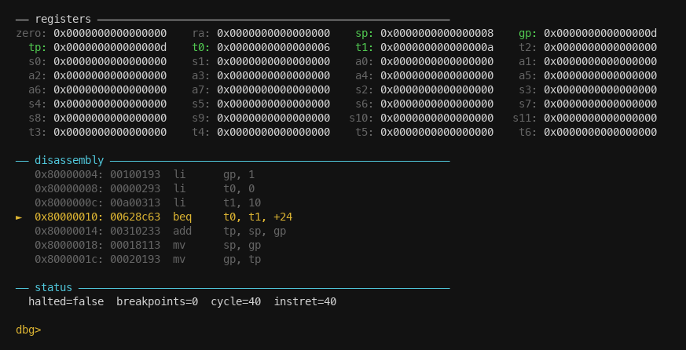

# risc-v virtual machine

A minimal **RV64IM** virtual machine in Rust with a zero-dependency live CLI debugger.

## Features

- RV64I base integer + M (multiply/divide) extension
- Machine-mode traps, CSRs, timer interrupts (CLINT)
- PLIC stub, 128 MB DRAM
- `no_std + alloc` core library — the VM itself has no OS dependency
- Interactive CLI debugger: step, breakpoints, register/disassembly view
- Unit, integration, and fault-injection tests

## Build & run

```sh
cargo build --release

# headless — built-in demo runs fib(10) = 55
./target/release/riscv-vm

# your own raw RV64I binary
./target/release/riscv-vm <binary.bin>

# interactive debugger (ANSI terminal)
./target/release/riscv-vm --debug [binary.bin]
```

Binary: raw flat RV64I binary loaded at `0x80000000`.

## Debugger



`►` marks the current PC. `●` marks a breakpoint. Non-zero registers are highlighted in green.

| Command     | Action                          |
|-------------|---------------------------------|
| `s` / Enter | step one instruction            |
| `r <n>`     | run n instructions              |
| `c`         | continue until breakpoint/halt  |
| `b [<hex>]` | toggle breakpoint (default: PC) |
| `q`         | quit                            |

## Test

```sh
cargo test
```

## Docker (headless)

```sh
docker build -t riscv-vm .
docker run --rm -v $(pwd):/work riscv-vm /work/program.bin
```

## Memory map

| Region | Base         | Size   |
|--------|--------------|--------|
| CLINT  | `0x02000000` | 1 MB   |
| PLIC   | `0x0C000000` | 64 MB  |
| DRAM   | `0x80000000` | 128 MB |
